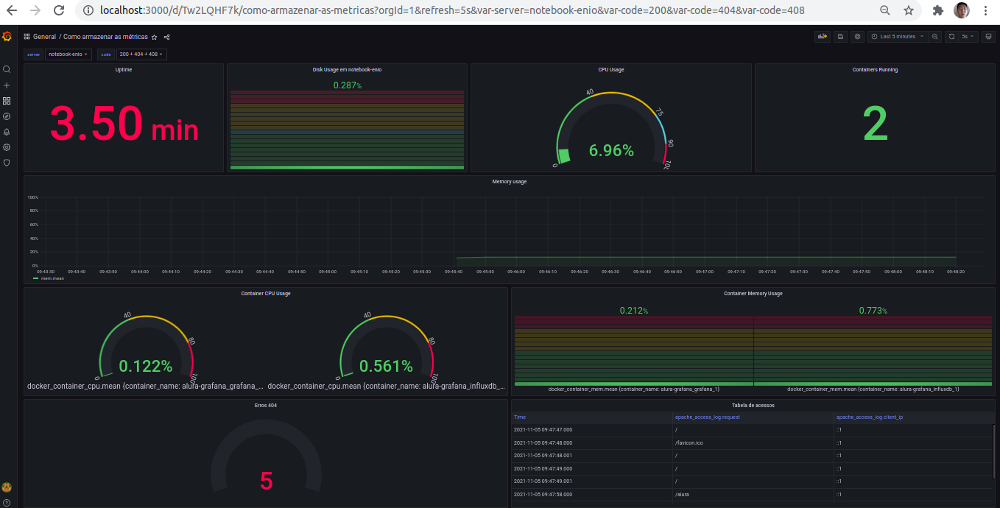

# alura-grafana
Curso da Alura sobre Grafana. <https://www.alura.com.br/curso-online-grafana-telegraf-monitoramento>

## Programas utilizados
- Grafana (Container, Interface para visualização dos dados).
- InfluxDB (Container, Banco de Dados das métricas).
- Telegraf (Gerador das métricas de infra).
    - [Instalação](https://docs.influxdata.com/telegraf/v1.20/introduction/installation/).
- stress-ng (Ferramenta para estressar a CPU).
    - `sudo apt-get install stress-ng`
- Apache2 (servidor web).
    - `sudo apt-get install apache2`

## Instruções

### Visualizar as métricas do InfluxDB
- Acessar o terminal do InfluxDB `docker exec -ti alura-grafana_influxdb_1 bash`.
- Acessar o influx `influx`.
- Acessar o banco de dados do telegraf `use telegraf`.
- Exibir as tabelas `show measurements`.

### Configurar o Datasource do InfluxDB
- Configuration > Data Sources > Add data source > InfluxDB:
    - Name: InfluxDB
    - HTTP > URL: http://influxdb:8086
    - HTTP > Access: Server
    - InfluxDB Details > Database: telegraf
    - Save & Test

### Criar Dashboard
- Create > Dashboard > Configurações
    - General > Name: Como armazenar as métricas

### Criar variável de servidor
- Dashboard > Configurações
- Variables > New:
    - Name: server
    - Type: Query
    - Data source: InfluxDB
    - Query: `SHOW TAG VALUES FROM system WITH KEY=host`

### Criar Panel de Uptime
- Add Panel > Add an empty panel
    - Datasource: InfluxDB
    - FROM: defaul system WHERE host = $server$
    - SELECT: field(uptime)
    - Visualization: Stat
    - Calculation: Last
    - Unit: seconds(s)
    - Title: Uptime

### Criar Panel de CPU Usage
- Add Panel > Add an empty panel
    - Datasource: InfluxDB
    - FROM: defaul cpu WHERE host = $server$ AND cpu = cpu-total
    - SELECT: field(usage_idle) math(*-1 + 100)
    - GROUP BY: time($__interval)
    - Visualization: Gauge
    - Show Threshold labels
    - Unit: Misc > Unit > Percent
    - Min: 0
    - Max: 100
    - Calculation: Last
    - Title: CPU Usage
    - Thresholds: 40, 75, 90
- Utilizar o comando `stress-ng --cpu 0 --cpu-load 95` para estressar a CPU.
    - cpu: Quantidade de CPU, 0 todos.
    - cpu-load: Percentual máximo de utilização.

### Criar Panel de Disk Usage
- Add Panel > Add an empty panel
    - Datasource: InfluxDB
    - FROM: defaul disk WHERE host = $server$ AND path = /home
    - SELECT: field(used_percentage)
    - GROUP BY: time($__interval)
    - Visualization: Bar Gauge
    - Unit: Misc > Unit > Percent
    - Min: 0
    - Max: 100
    - Orientation: Vertical
    - Display Mode: Retro LCD
    - Calculation: Last
    - Title: Disk Usage em $server
    - Thresholds: 40, 50, 80
- Utilizar o comando `dd if=/dev/zero of=image.img bs=1M count=3000` para criar um arquivo de 3GB.

### Criar Panel de Memory Usage
- Add Panel > Add an empty panel
    - Datasource: InfluxDB
    - FROM: defaul mem WHERE host = $server$
    - SELECT: field(used_percentage)
    - GROUP BY: time($__interval)
    - Visualization: Time Series
    - Fill Opacity: 7
    - Connect null value: Always
    - Unit: Misc > Unit > Percent
    - Min: 0
    - Max: 100
    - Calculation: Last
    - Title: Memory Usage
    - Thresholds: 40, 50, 80
- Utilizar o comando `stress-ng --vm-bytes $(awk '/MemAvailable/{printf "%d\n", $2 * 0.9;}' < /proc/meminfo)k --vm-keep -m 1`.

### Observar infra dos containers Docker
- Permitir o Telegraf observar os containers `sudo usermod -aG docker telegraf`.
- Alterar o arquivo de configuração do Telegraf `sudo gedit /etc/telegraf/telegraf.conf`.
    - Descomentar as linhas:
      - `inputs.docker`
      - `endpoint`
      - `container_names`
      - `container_name_include`
      - `container_name_exclude`
      - `timeout`
      - `total`
- Reiniciar o serviço do Telegraf `sudo service telegraf restart`.
- Verificar se o serviço está rodando `sudo service telegraf status`.

### Criar Panel de Containers running
- Add Panel > Add an empty panel
    - Datasource: InfluxDB
    - FROM: defaul docker WHERE host = $server$
    - SELECT: field(n_containers_running)
    - GROUP BY: time($__interval)
    - Visualization: Stat
    - Calculation: Last
    - Title: Containers Running

### Criar Panel de Container CPU running
- Add Panel > Add an empty panel
    - Datasource: InfluxDB
    - FROM: defaul docker_container_cpu WHERE host = $server$
    - SELECT: field(usage_percent)
    - GROUP BY: time($__interval) tag(container_name)
    - Visualization: Gauge
    - Show Threshold labels
    - Unit: Misc > Unit > Percent
    - Min: 0
    - Max: 100
    - Calculation: Last
    - Title: Container CPU Usage
    - Thresholds: 40, 8

### Criar Panel de Container Memory running
- Add Panel > Add an empty panel
    - Datasource: InfluxDB
    - FROM: defaul docker_container_mem WHERE host = $server$
    - SELECT: field(usage_percent)
    - GROUP BY: time($__interval) tag(container_name)
    - Visualization: Bar Gauge
    - Unit: Misc > Unit > Percent
    - Min: 0
    - Max: 100
    - Calculation: Last
    - Title: Container Memory Usage
    - Thresholds: 40, 80

### Observar log do Apache
- Permitir o Telegraf observar o log do apache `sudo usermod -aG adm telegraf`.
- Alterar o arquivo de configuração do Telegraf `sudo gedit /etc/telegraf/telegraf.conf`.
    - Descomentar as linhas:
      - `inputs.logparser`
      - `files = ["/var/log/apache2/access.log"]`
      - `from_beginning = true`
      - `inputs.logparser.grok`
      - `patterns`
      - `measurement`
- Reiniciar o serviço do Telegraf `sudo service telegraf restart`.
- Verificar se o serviço está rodando `sudo service telegraf status`.

### Criar Panel de Logs do Apache
- Add Panel > Add an empty panel
    - Datasource: InfluxDB
    - Query Manual: `SELECT count("request") FROM "apache_access_log" WHERE ("host" =~ /^$server$/)  AND "resp_code" = '404'  AND $timeFilter AND "agent" != 'Go-http-client/1.1' AND agent != 'worldping-api'`
    - Visualization: Gauge
    - Unit: Misc > Unit > None
    - Min: 0
    - Calculation: Total
    - Title: Erros 404
- Acessar um site que não existe no apache. Ex: <http://localhost/alura>

### Criar variável de servidor
- Dashboard > Configurações
- Variables > New:
    - Name: code
    - Type: Query
    - Data source: InfluxDB
    - Refresh: On time range change
    - Query: `SHOW TAG VALUES WITH KEY = "resp_code" WHERE host =~ /^$server$/`
    - Multi-value: true

### Criar Panel de Tabela dos acessos
- Add Panel > Add an empty panel
    - Datasource: InfluxDB
    - Query 1 Manual: `SELECT "request" FROM "apache_access_log" WHERE host =~ /^$server$/ AND "resp_code" =~ /^$code$/ AND $timeFilter`
    - Query 2 Manual: `SELECT "client_ip" FROM "apache_access_log" WHERE host =~ /^$server$/ AND "resp_code" =~ /^$code$/ AND $timeFilter`
    - Transform > Outer Join:
      - Field name: Time
    - Visualization: Table
    - Title: Tabela de acessos
- Acessar um site que existe no apache. Ex: <http://localhost>
- Acessar um site que não existe no apache. Ex: <http://localhost/alura>
